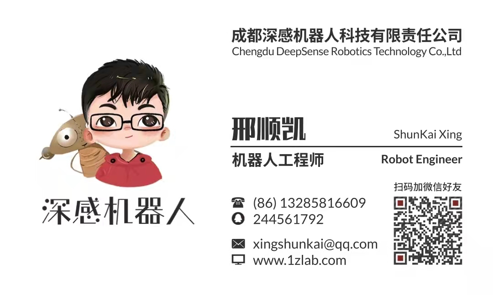

# GamePad-Python|游戏手柄

[toc]

作者: 阿凯爱玩机器人 | QQ:  244561792 | 微信: xingshunkai

[1Z实验室](http://1zlab.com/) | [B站](https://space.bilibili.com/40344504) | [知乎](https://www.zhihu.com/people/mushroom-x)


## 概要

一个游戏手柄库`GamePad-Python`，基于`inputs`。

主要功能如下:

* 创建了三种传感器类， 包括普通按键、十字按键、遥杆。
* 根据自己的手柄布局， 自由配置组合自己的游戏手柄类。
* 基于事件的，灵活的回调函数配置。 例如按键事件: 按键按下， 按键抬起， 以及按键更新。
* 多线程手柄事件查询，可终止。

## 使用手册

1. [inputs库使用教程](doc/1.inputs库使用教程(Linux)/inputs库使用教程(Linux).md)
2. [定制自己的游戏手柄类](doc/2.定制自己的游戏手柄类/定制自己的游戏手柄类.md)
3. [GamePad库Python使用示例](doc/3.GamePad库Python使用示例/GamePad库Python使用示例.md)

## 快速入手

**导入依赖**

```python
# 日志模块
import logging
# 自定义库
# 用户需要根据自己手柄的情况, 编写gamepad的子类
# 在init_sensor函数里面定义都有哪些传感器组件，以及编号
# 详情参见`gamepad.py`与`gulikit.py`
from gulikit import Gulikit
```

**创建手柄对象**

```python
# 创建手柄，可以设置不同的日志模式
# 在INFO等级下，可以显示手柄所有的按键交互日志信息。
pad = Gulikit(logging_level=logging.INFO)
# pad = Gulikit(logging_level=logging.WARN)
```

**定义回调函数**

**键盘事件绑定**

```python
# 绑定回调函数
def a_click():
    print("按键A按下")

def a_release():
    print("按键A释放")
    
def a_change():
    print("按键A数值变动")

pad.btn_a.on_click = a_click
pad.btn_a.on_release = a_release
pad.btn_a.on_change = a_change
```

**十字按键绑定**

> 注: 十字按键的四个元素， 都可以当普通按键来使用。


```python
def cross_btn_update():
    position = pad.btn_cross.get_position()
    print(f"十字按键更新, 坐标: {position}")

def cross_btn_release():
    print("十字按键释放")

pad.btn_cross.on_change = cross_btn_update
pad.btn_cross.on_release = cross_btn_release
```

**遥杆按键事件绑定**


```python
def left_joystick_change():
    position = pad.left_joystick.get_position()
    print(f"遥杆位置更新: {position}")

pad.left_joystick.on_change = left_joystick_change
```

**开启手柄事件监听线程**

```python
# 手动执行事件监听器
pad.start_event_listener_thread()
```

详细信息，见手册 [GamePad库Python使用示例](doc/GamePad库Python使用示例/GamePad库Python使用示例.md)


## 联系作者



